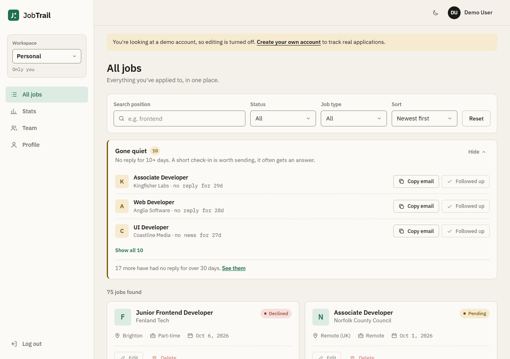
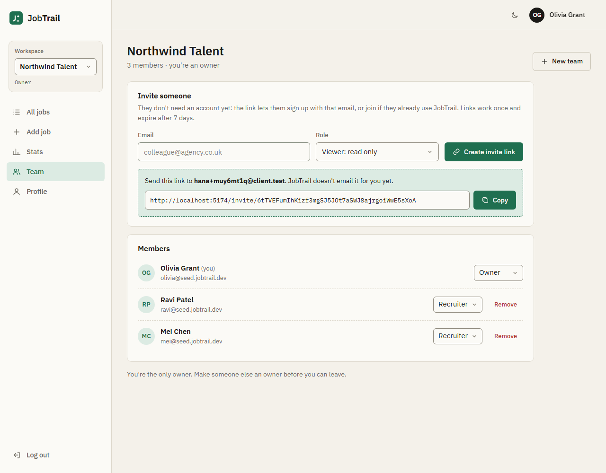
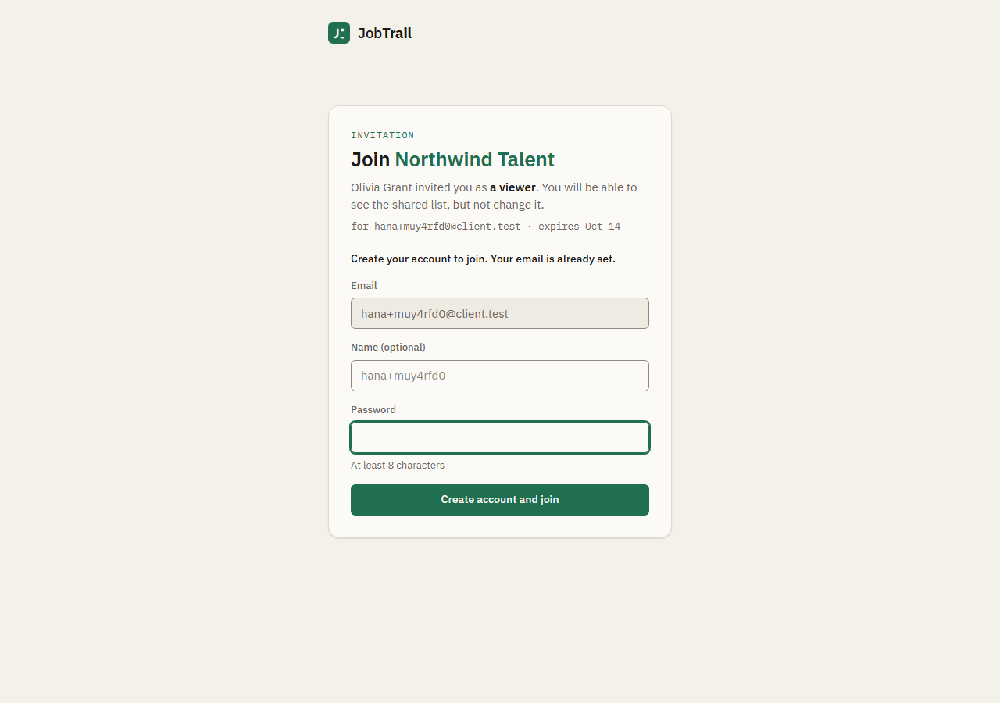
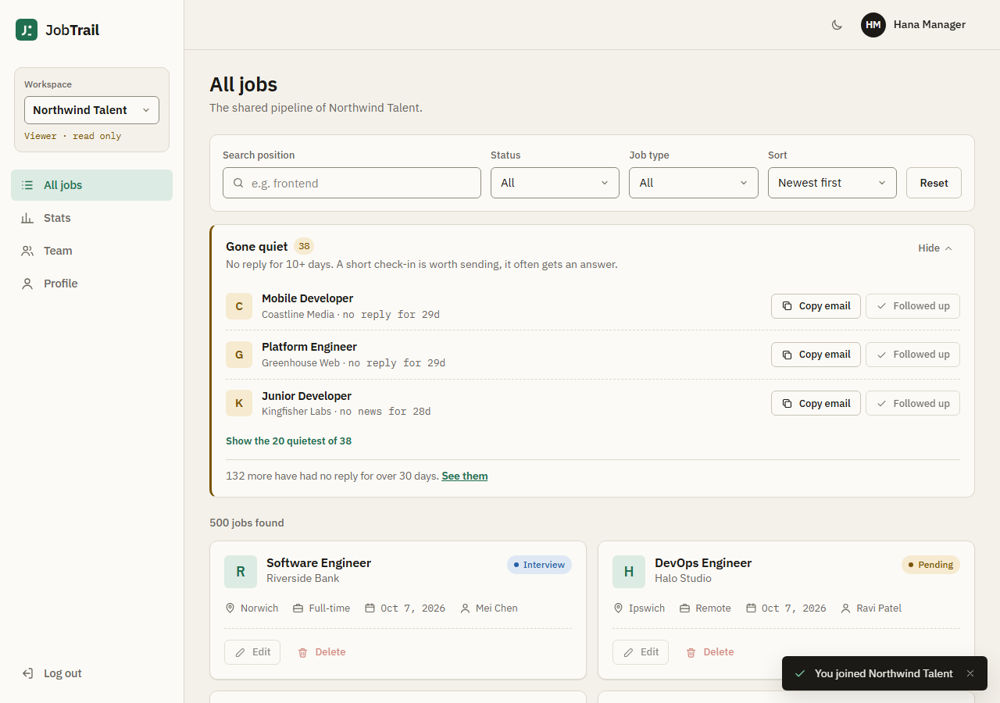
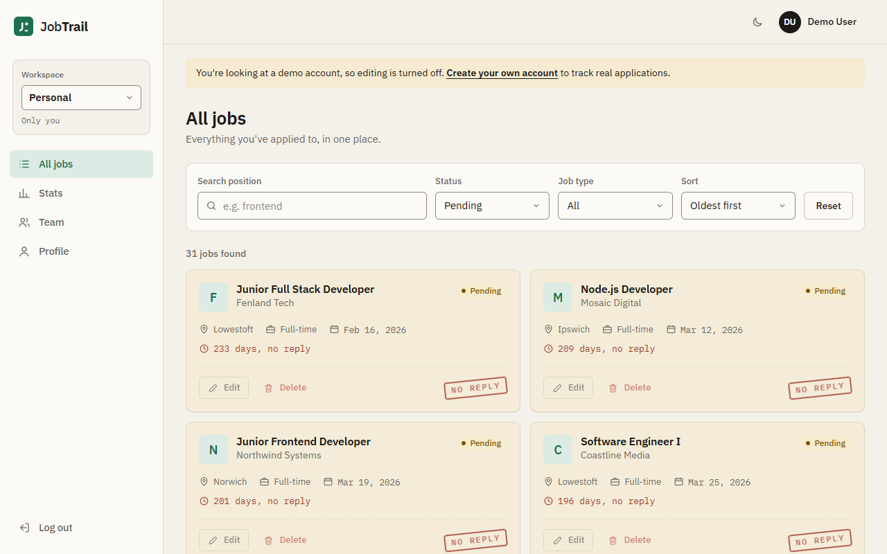
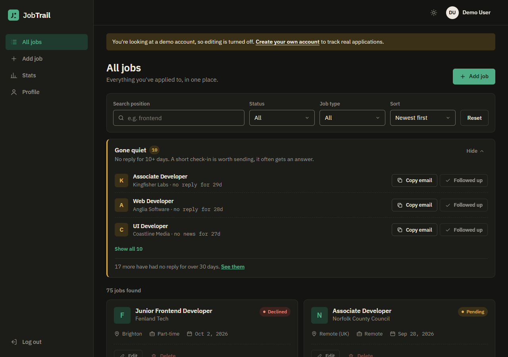
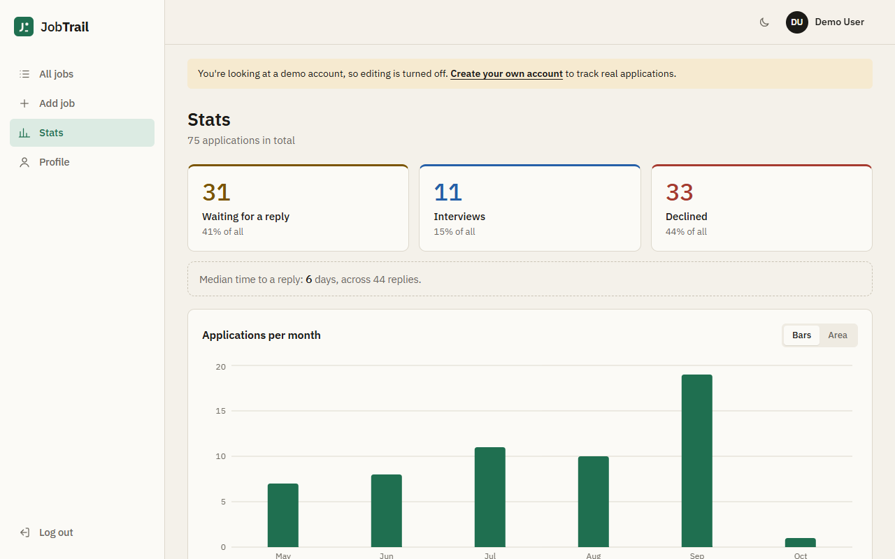
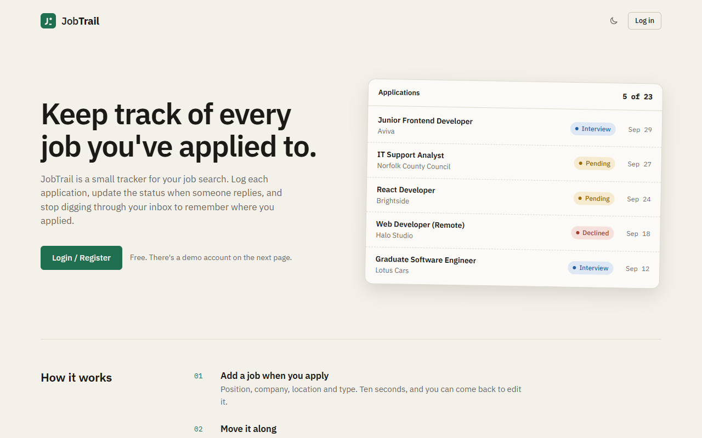
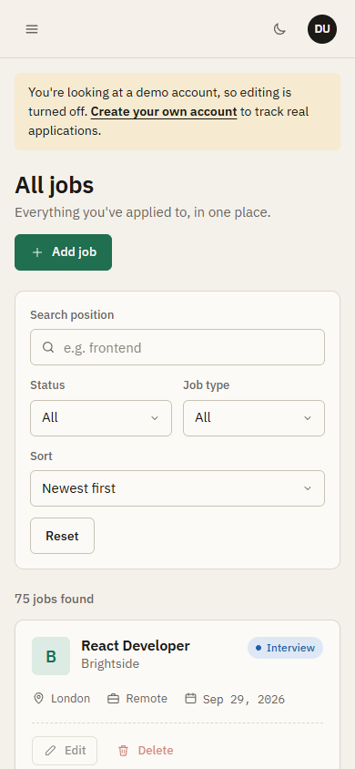

# JobTrail

A job application tracker built with MongoDB, Express, React and Node. v1 was a personal list: log every job you apply to, move it between `pending`, `interview` and `declined`, search and filter it later. v2 adds teams: several people share one pipeline, with roles and invitations by email.

Built as a test task (step 1: junior, step 2: team version).

**Live:** https://jobtrail-two.vercel.app
**Demo:** click "Look around with a demo account" on the login page (read-only, ~75 sample jobs).

> Hosted on Vercel (React build on the CDN, the Express API as a serverless function) with MongoDB Atlas. The brief says Render, but v1 was reviewed on this Vercel URL, so v2 stays here. The migration runs in the Vercel build step and traffic only switches after it succeeds, which is the same guarantee as the Render start-command hook. `render.yaml` is there and works too, see [Deploying](#deploying).



<details>
<summary>More screenshots</summary>










</details>

## What's new in v2

- **Organizations and memberships.** Every account has a Personal workspace (created on sign-up, so solo use works exactly like v1). Anyone can create a team. Roles are per organization: `owner`, `recruiter`, `viewer`.
- **Active organization.** The JWT still only carries `userId`. Requests act in the org from the `X-Org-Id` header, or in the Personal workspace when it's missing. The UI has a workspace switcher.
- **Org-scoped jobs.** Jobs belong to an organization. Owners and recruiters write, viewers get 403. Every job carries `createdByName`, so a shared list shows who added what without a second request.
- **Invitations.** Owners invite by email and get a link. The invitee either joins in one click (already signed in), logs in, or creates an account straight from the link. Links are single-use and expire after 7 days.
- **`GET /stats`.** One aggregation pipeline (`$match` → `$facet` → `$project`): counts by status, the last 6 months with zeros filled in, top 3 companies. p95 is **3.3 ms** on the 500-job dataset ([benchmark output](docs/perf/stats-benchmark.txt)).
- **Migration `001-orgs`.** Gives every existing user a Personal org and moves their jobs into it. It's idempotent and runs on every deploy.
- **Tests.** 77 API tests on an in-memory MongoDB replica set (coverage of controllers/models/migrations: 93.6% of statements) and 7 React Testing Library tests for the invite page.
- **Architecture decisions:** [docs/adr](docs/adr): [permission model](docs/adr/ADR-001-permission-model.md), [legacy data migration](docs/adr/ADR-002-legacy-data-migration.md), [invitation UX](docs/adr/ADR-003-invitation-ux.md).

## What's in it (v1)

Required by the task:

- Register / login with JWT (bcryptjs for passwords, token returned in the response body, expires in 1 day)
- Jobs CRUD with filters by status and job type, search by position, sorting, pagination
- React + Vite frontend with react-router v6, protected `/dashboard/*` routes and a nested layout
- Axios instance with a request interceptor for the token and a response interceptor that logs out on 401

Things I added on top:

- **Follow-up reminders.** A job that has been quiet for 10+ days (no status change, no follow-up) shows up in a "Gone quiet" panel above the list, with a short check-in email ready to copy. "Followed up" resets the timer. Pending jobs with no answer for 30+ days get an aged card and a "no reply" stamp. The server records when a job first left `pending` (a pre-save hook), which also gives the median time to a reply on the Stats page.
- Input validation on the server (express-validator) and in the forms, errors shown next to the field
- helmet with a strict CSP, `express-mongo-sanitize`, 10kb body limit, `Cache-Control: no-store` on API responses
- Rate limits: 20 failed logins per 15 min, 60 auth requests per 15 min, 10 sign-ups per hour, 600 API requests per 15 min (all per IP), 10 profile changes per hour. Passwords need 8+ characters and can't be one of the most common ones
- Read-only demo account, filters in the URL, profile editing, dark theme, responsive down to ~360px

## Stack

**Server:** Node 22, Express 4, Mongoose 9, jsonwebtoken, bcryptjs, express-async-errors, express-validator
**Client:** React 19, Vite, react-router-dom 6, axios, recharts, dayjs. Plain CSS Modules, no UI library.
**Tests:** Vitest, Supertest, mongodb-memory-server, React Testing Library

## Running locally

You need Node 22.12+ and a MongoDB that runs as a **replica set**: sign-up and accepting an invitation use transactions. A free Atlas cluster works out of the box; a plain local `mongod` needs `--replSet`.

```bash
git clone https://github.com/bullsrust-lab/test.git jobtrail
cd jobtrail
npm install
cp .env.example .env    # then fill in the values
npm run migrate         # only matters if the database has v1 data
npm run dev
```

`npm run dev` starts both apps with `concurrently`:

- API on http://localhost:5000
- React on http://localhost:5173 (Vite proxies `/api` to the API, using the same `PORT` from `.env`)

If port 5000 is taken (on macOS the AirPlay Receiver uses it), set another `PORT` in `.env`.

### Environment variables

The `.env` file goes in the project root.

| Variable        | Description                                             | Example                    |
| --------------- | ------------------------------------------------------- | -------------------------- |
| `PORT`          | API port                                                | `5000`                     |
| `NODE_ENV`      | `development` or `production`                           | `development`              |
| `MONGO_URI`     | MongoDB connection string (replica set)                 | `mongodb+srv://...`        |
| `JWT_SECRET`    | Secret used to sign tokens, at least 32 random characters (the server won't start with a shorter one) | |
| `JWT_LIFETIME`  | Token lifetime                                          | `1d`                       |
| `DEMO_EMAIL`    | Email of the demo user created by `npm run seed`        | `demo@jobtrail.dev`        |
| `DEMO_PASSWORD` | Password for the demo user (nobody needs to know it)    |                            |
| `APP_URL`       | Optional. Base of invite links when the site and the API are on different hosts; by default the request's host is used | `https://jobtrail.example` |
| `SEED_URL`      | Database for `npm run seed:team` and `npm run bench:stats`. Use a dev database | `mongodb://localhost:27017/jobtrail_seed?replicaSet=rs0` |
| `SEED_PASSWORD` | Password of the seeded team members. Required unless `SEED_URL` is local (then it defaults to `northwind-seed-2026`) | |

A quick way to generate a secret:

```bash
node -e "console.log(require('crypto').randomBytes(48).toString('base64url'))"
```

### Scripts

| Command                   | What it does                                     |
| ------------------------- | ------------------------------------------------ |
| `npm run dev`             | API + client in watch mode                       |
| `npm run build`           | Builds the client into `client/dist`             |
| `npm start`               | Runs the API, which also serves `client/dist` when `NODE_ENV=production` |
| `npm run migrate`         | Runs the migrations (see below)                  |
| `npm run seed`            | Creates the demo user and 75 sample jobs for it (only the demo user's jobs are replaced) |
| `npm run seed:team`       | Creates the 500-job team dataset in `SEED_URL`   |
| `npm run bench:stats`     | Measures `GET /stats` against that dataset       |
| `npm test`                | API tests on an in-memory MongoDB replica set, no `.env` needed (the first run downloads a MongoDB binary) |
| `npm test -- --coverage`  | Same, with the coverage report for `server/controllers`, `models` and `migrations` (fails under 65%) |
| `npm run test:client`     | React Testing Library tests                      |
| `npm run lint`            | oxlint over client and server, warnings fail the run |

## Running the seed and migration scripts

### Migration

```bash
npm run migrate
```

`server/migrations/run.js` runs every migration in order and prints what each one did. There is one so far, [`001-orgs`](server/migrations/001-orgs.js):

```
001-orgs
  users processed                                  2
  orgs created                                     2
  jobs migrated                                    77
  users already migrated (skipped)                 1
  jobs whose author no longer exists (left as is)  0
```

It creates a Personal organization for every user who has no membership, makes them its owner and moves their jobs (those without an organization) into it. Running it again changes nothing (`users processed 0`, everything skipped). There's a test that asserts exactly that, and one that runs two migrations at the same time. A run that died halfway is finished by the next one. [ADR-002](docs/adr/ADR-002-legacy-data-migration.md) explains how.

It runs on every deploy: in the Vercel build command (`npm run migrate && npm run build`, see `vercel.json`) and in the Render start command (`npm run migrate && npm start`, see `render.yaml`). With nothing to do it exits 0 in a few milliseconds. If it fails, it exits 1: the build or start fails and the previous deployment keeps serving. The migration only adds fields, so v1 code keeps working on migrated data.

### Team seed and the stats benchmark

```bash
# a dev database, not production
SEED_URL="mongodb://localhost:27017/jobtrail_seed?replicaSet=rs0" npm run seed:team
SEED_URL="mongodb://localhost:27017/jobtrail_seed?replicaSet=rs0" npm run bench:stats
```

`seed:team` creates "Northwind Talent" with an owner and two recruiters (`olivia@`, `ravi@`, `mei@seed.jobtrail.dev`) and 500 jobs from the last 12 months. Recent months are busier, and all statuses and job types are present. The random generator is seeded, so every run produces the same dataset. A viewer can't add jobs, so the jobs are spread over the three members who can.

What it does with existing data (one of the open questions in the brief): it **only ever touches its own data**. Re-running removes the previous seed (its org, its users, their jobs) and creates it again. If the database has any other users, it refuses to run unless you pass `--force`, and even then it leaves that data alone. Wiping the database first is one wrong `SEED_URL` away from deleting production. Appending blindly would pile up duplicates on every run. Refusing whenever the database isn't empty would make it impossible to re-run.

`bench:stats` starts the app on a random port, signs in as the seeded owner and sends 300 sequential requests to `GET /api/v1/stats` (after 20 warm-up ones). Result on my laptop (Ryzen 7 9800X3D, MongoDB 8.2), full output in [docs/perf/stats-benchmark.txt](docs/perf/stats-benchmark.txt):

```
GET /api/v1/stats  Northwind Talent, 500 jobs, 3 members
  p50   3.0 ms
  p95   3.3 ms   (ceiling: 200 ms)
  p99   3.5 ms
  index used: organization_1_createdAt_-1, documents examined: 500
```

## Teams, roles and invitations

| Role        | Read jobs and stats | Add, edit, delete jobs | Invite, change roles |
| ----------- | ------------------- | ---------------------- | -------------------- |
| `owner`     | yes                 | yes                    | yes                  |
| `recruiter` | yes                 | yes                    | no                   |
| `viewer`    | yes                 | no (403)               | no                   |

Why these three and how they combine with the old `checkPermission`: [ADR-001](docs/adr/ADR-001-permission-model.md). In short: the route checks your role in the active org, the job checks that it belongs to that org. A job from another org answers 404, the same as a missing one, so ids can't be probed. That's a change from v1, where a stranger's job answered 403.

Invitations: [ADR-003](docs/adr/ADR-003-invitation-ux.md). Personal workspaces can't be shared, and inviting an existing member answers 409.

**What happens when an owner leaves** (the other open question): the last owner can't leave while anyone else is in the team. `DELETE /orgs/:id/memberships/me` answers 409 until someone else is an owner (`PATCH /orgs/:id/memberships/:membershipId` changes roles). Auto-promoting could hand the team to a viewer, often someone outside the agency. Deleting the org would wipe a pipeline other people rely on. Making the owner pick a successor is one extra click, and it's the only option that can't go wrong silently. The same rule stops an owner from demoting themselves when they're the only one. If the owner is the only member, leaving deletes the team with its jobs and invitations (the Team page calls it "Delete team" and asks first). Nobody can leave their Personal workspace.

Owners can also remove members. Role changes, removals and leaving run in a transaction that also writes the organization document, so two owner changes at the same moment (say, one owner demotes the other while leaving) can't leave a team with none: the second transaction conflicts, retries, sees the first one's change and gets the 409. There's a test for exactly that. When an owner is demoted or removed, the invite links they created are cancelled.

## API

All routes are under `/api/v1`. Errors always come back as `{ "msg": "..." }`. Validation errors add an `errors` array with the field names, and a few errors add a machine-readable `code`.

Org-scoped routes (`/jobs/*`, `/stats/*`) act in the organization from the `X-Org-Id` header. Without the header they act in your Personal workspace. A malformed id answers 400. An org you're not a member of answers 403 with `code: "NOT_A_MEMBER"`, whether it exists or not.

### Auth and profile

| Method | Path              | Auth | Notes                                   |
| ------ | ----------------- | ---- | --------------------------------------- |
| POST   | `/auth/register`  | no   | `{ name, email, password }` → 201 `{ user, token }`, also creates the Personal workspace |
| POST   | `/auth/login`     | no   | `{ email, password }` → `{ user, token }` |
| POST   | `/auth/demo`      | no   | logs in as the read-only demo user      |
| GET    | `/users/me`       | yes  | current user                            |
| PATCH  | `/users/me`       | yes  | `{ name, email }`, returns a new token; a new name is copied to `createdByName` on your jobs |

### Jobs (org-scoped)

| Method | Path                  | Role               | Notes                                   |
| ------ | --------------------- | ------------------ | --------------------------------------- |
| GET    | `/jobs`               | any member         | query params below                      |
| POST   | `/jobs`               | owner, recruiter   | 201 `{ job }`                           |
| GET    | `/jobs/:id`           | any member         | 404 if the job is in another org        |
| PATCH  | `/jobs/:id`           | owner, recruiter   |                                         |
| DELETE | `/jobs/:id`           | owner, recruiter   |                                         |
| GET    | `/jobs/follow-ups`    | any member         | jobs quiet for 10-30 days + count of 30+ day ones |
| POST   | `/jobs/:id/follow-up` | owner, recruiter   | resets the follow-up timer              |

`GET /jobs` query params: `status` (`all`, `pending`, `interview`, `declined`), `jobType` (`all`, `full-time`, `part-time`, `remote`), `sort` (`latest`, `oldest`, `a-z`, `z-a`), `search`, `page` (default 1), `limit` (default 10, max 50).

```json
{
  "jobs": [
    {
      "_id": "6ac6...",
      "company": "Aviva",
      "position": "Frontend Developer",
      "status": "interview",
      "jobType": "full-time",
      "jobLocation": "Norwich",
      "organization": "6ac6...",
      "createdBy": "6ac6...",
      "createdByName": "Ravi Patel",
      "createdAt": "2026-10-01T09:12:00.000Z",
      "updatedAt": "2026-10-04T15:40:00.000Z"
    }
  ],
  "totalJobs": 42,
  "numOfPages": 5
}
```

### Stats (org-scoped)

`GET /stats`: one aggregation pipeline, any member. Months are calendar months in UTC, oldest first, with zeros filled in; ties in `topCompanies` are broken by company name.

```json
{
  "countsByStatus": { "pending": 181, "interview": 134, "declined": 185 },
  "applicationsPerMonth": [
    { "month": "2026-05", "count": 49 },
    { "month": "2026-06", "count": 75 },
    { "month": "2026-07", "count": 72 },
    { "month": "2026-08", "count": 55 },
    { "month": "2026-09", "count": 87 },
    { "month": "2026-10", "count": 19 }
  ],
  "topCompanies": [
    { "company": "Brightside", "count": 41 },
    { "company": "Parkside Agency", "count": 34 },
    { "company": "Kingfisher Labs", "count": 33 }
  ]
}
```

`GET /stats/reply-time` → `{ "replyTime": { "medianDays": 6, "replies": 44 } }` (or `null`). It's separate because the `/stats` shape is fixed by the brief.

### Organizations

These take the org from the URL, not from `X-Org-Id`. Not being a member answers 403.

| Method | Path                                  | Who          | Notes |
| ------ | ------------------------------------- | ------------ | ----- |
| GET    | `/orgs`                               | signed in    | `{ organizations: [{ _id, name, slug, personal, role }] }`, Personal first |
| POST   | `/orgs`                               | signed in    | `{ name }` (3-80 chars) → 201 `{ organization, role: "owner" }`; the slug comes from the name (`acme`, `acme-2`, ...) |
| GET    | `/orgs/:orgId`                        | member       | `{ organization, role, members: [{ membershipId, userId, name, email, role, joinedAt }], invitations }`. Pending invitations are only listed for owners |
| POST   | `/orgs/:orgId/invitations`            | owner        | `{ email, role }` → 201 `{ invitation, token, inviteUrl }`. 400 for a Personal workspace, 409 if already a member; inviting the same address again cancels the old link |
| DELETE | `/orgs/:orgId/invitations/:id`        | owner        | cancels a pending invitation |
| PATCH  | `/orgs/:orgId/memberships/:id`        | owner        | `{ role }`; 409 if it would leave the org without an owner |
| DELETE | `/orgs/:orgId/memberships/:id`        | owner        | removes a member; 409 for the last owner (use `/me` to leave) |
| DELETE | `/orgs/:orgId/memberships/me`         | member       | leave; 409 for the last owner of a team with other members, deletes the team if you're its only member, 400 for your Personal workspace |

### Invitations (public)

| Method | Path                          | Notes |
| ------ | ----------------------------- | ----- |
| GET    | `/invitations/:token`         | preview: `{ invitation: { email, role, expiresAt, organization, invitedBy } }`. It doesn't say whether the email is registered ([ADR-003](docs/adr/ADR-003-invitation-ux.md)) |
| POST   | `/invitations/:token/accept`  | signed in with the invited email → 200 `{ organization, role }`; signed in as someone else → 403; not signed in and no account → body `{ password, name? }` → 201 `{ user, token, organization, role }`; not signed in but the account exists → 409 (log in first) |

Both answer 404 for an unknown token and **410 Gone** for an expired, used or cancelled one.

Status codes overall: 200, 201, 400 (validation, bad id), 401 (no/invalid token, wrong credentials), 403 (role too low, not a member, wrong account for an invite, demo user writes), 404, 409, 410, 413 (body over 10 kB), 429 (rate limits).

## Tests

```bash
npm test                 # 77 API tests
npm test -- --coverage   # + coverage, threshold 65%
npm run test:client      # 7 React Testing Library tests
```

The API tests run on one in-memory MongoDB replica set (transactions need one), with a separate database per test file. They cover both invitation flows and every 4xx/410 branch, writes as owner/recruiter/viewer, stats against a fixture whose numbers are worked out by hand (plus a check that `/stats` makes exactly one `aggregate()` call and no `find()`), the 500-job seed with a p95 check, the migration (twice in a row, twice at the same time, after a simulated crash), and the v1 regression flow: register → create → filter → paginate → delete.

Coverage of `server/controllers`, `server/models` and `server/migrations` (the runner included): 93.6% statements, 80.7% branches, 100% functions, 96.6% lines.

## Project structure

```
client/
  src/
    api/          axios instance (token + X-Org-Id) and interceptors
    components/   JobCard, JobForm, filters, pagination, org switcher, modal...
    context/      auth, organizations, theme and toast providers
    layouts/      dashboard layout (sidebar + top bar)
    pages/        one file per route (Team, AcceptInvite + its tests, ...)
    routes/       ProtectedRoute
    utils/        follow-up rule, storage helpers, constants
server/
  config/       .env loading (the file is in the repo root), env checks, DB connection
  controllers/  route handlers (auth, jobs, orgs, invitations, stats, users)
  errors/       error classes with status codes
  middleware/   auth, org context + role check, validation, rate limits, errors
  migrations/   001-orgs + the runner behind npm run migrate
  models/       User, Organization, Membership, Invitation, Job
  routes/
  scripts/      seed-team, bench-stats
  seed/         demo data
  tests/
docs/
  adr/          architecture decision records
  perf/         benchmark output
```

## Deploying

The same Express app runs two ways, so it can go on either host.

### Vercel (what the live link uses)

`vercel.json` runs the migrations and builds the client in one build command, serves `client/dist` from Vercel's CDN and sends `/api/*` to `api/index.mjs`. That's a small wrapper that runs the Express app as one serverless function and reuses the MongoDB connection while the function is warm. Vercel switches traffic only after a successful build, so a failing migration never takes the site down.

1. Import the repo in Vercel (no framework preset needed, `vercel.json` has the settings).
2. Add environment variables: `MONGO_URI` and `JWT_SECRET` (32+ random characters). Vercel sets `NODE_ENV` itself.
3. Deploy.

The API rate limits keep their counters in memory, so on serverless each warm instance counts on its own. Good enough for a demo; a shared store (Redis) would be the fix for real traffic.

### Render

`render.yaml` describes one Web Service that serves both the API and the built React app, with `npm run migrate && npm start` as the start command. New → Blueprint, point it at the repo, and fill in `MONGO_URI` (Render generates `JWT_SECRET`). The free plan sleeps after 15 minutes, so the first request can take up to a minute.

### Both

In Atlas, Network Access has to allow `0.0.0.0/0`: neither host has fixed outbound IPs on the free plan.

The demo account needs data: run `npm run seed` once with `MONGO_URI` pointing at the same database the host uses. After that the demo keeps itself fresh: on demo login the sample dates are moved forward (at most every 12 hours), so the follow-up panel always has something to show.

## Notes

- The token lives in `localStorage` because the task asks for it in the response body. It's readable by any script on the page, so for a real app I'd move to an httpOnly cookie with a short-lived access token and a refresh token.
- Invitations return a link instead of sending an email. A mailer (and showing pending invites to the invitee in the app) is the obvious next step.
- No end-to-end tests in the repo. I ran the invite flow end to end in headless Chrome while building it; committing that as Playwright tests would be next.
- Search uses a case-insensitive regex on `position`. Fine for a few thousand jobs per org; beyond that a text index.
- `createdByName` is a copy, kept in sync on rename with one `updateMany`. That's cheap while users rename rarely and a list request is the hot path.
